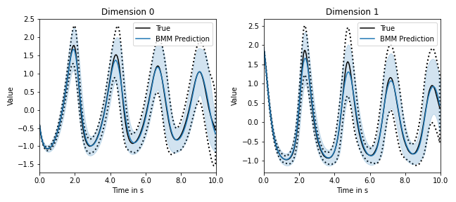

# Bidimensional Moment Matching for NSDEs

This is the companion code for the NSDE training method reported in 
[A Deterministic Approximation to Neural SDEs by Andreas Look et al., IEEE TPAMI 2022](https://ieeexplore.ieee.org/document/9869331).

## Purpose of the project

This software is a research prototype, solely developed for and published as
part of the publication cited above. It will neither be
maintained nor monitored in any way.

## Requirements

The code depends on PyTorch and NumPy. For visualization Matplotlib is also necessary.

## Reproducing results

This code contains a tutorial like jupyter notebook. After running it, a similar image as below should be 
produced. The image shows ground truth mean (black solid line) and covariance (black dashed line) of the stochastic 
Lotka-Volterra dynamics. 
The blue solid is the learned mean and the blue shaded are is the learned covariance. 

